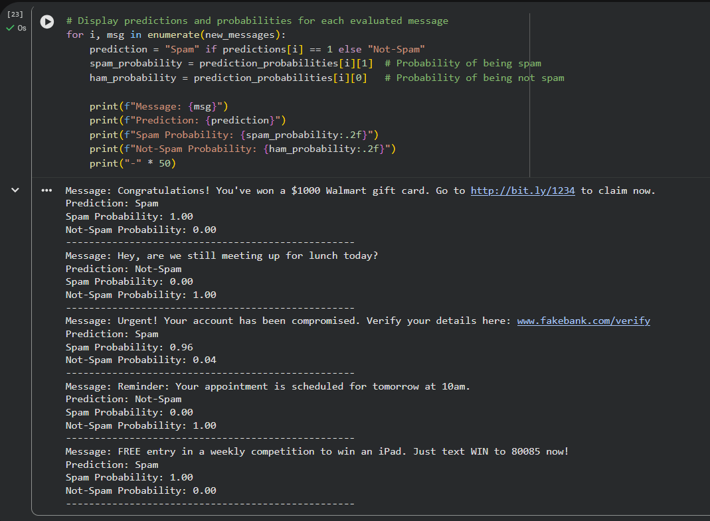

# Project Screenshots

This section contains visual evidence of the spam classification pipeline execution.

---

## Dataset Overview

Displays dataset structure, labels, and basic statistics after loading the SMS Spam Collection dataset.

---

## Model Predictions and Probabilities

Shows spam vs non-spam predictions along with class probabilities generated using Multinomial Naive Bayes.

---

## Classification Confidence

Demonstrates probability-based classification confidence for real-world SMS examples.
